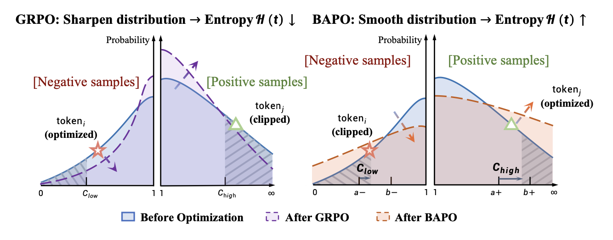
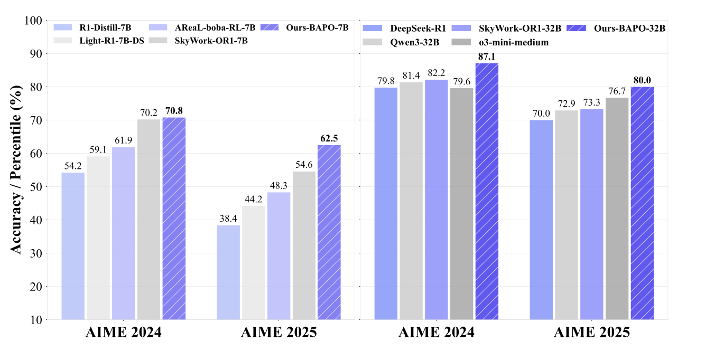

<div align="center">

# BAPO: Balanced Policy Optimization with Adaptive Clipping for LLMs

[](https://arxiv.org/abs/2505.XXXXX) [](https://github.com/WooooDyy/BAPO) [](https://x.com/your_twitter)

<div align="center" style="font-family: Arial, sans-serif; margin-top: 10px;">
  <p style="color: #666; font-size: 0.9em;">
    Note: The arXiv paper link is not yet available. Please refer to <a href="./paper.pdf" style="color: #A42C25;">paper.pdf</a> for the full paper.
  </p>
</div>

<div align="center" style="font-family: Arial, sans-serif;">
  <p>
    <a href="#✨getting-started" style="text-decoration: none; font-weight: bold;">✨ Getting Started</a> •
    <a href="#📖introduction" style="text-decoration: none; font-weight: bold;">📖 Introduction</a>
  </p>
  <p>
    <a href="#🎈citation" style="text-decoration: none; font-weight: bold;">🎈 Citation</a> •
    <a href="#🌻acknowledgement" style="text-decoration: none; font-weight: bold;">🌻 Acknowledgement</a> •
    <a href="#📬Contact" style="text-decoration: none; font-weight: bold;">📬 Contact</a>
  </p>
</div>

</div>

# ✨Getting started

This repository implements **Balanced Policy Optimization with Adaptive Clipping (BAPO)**, a simple yet effective reinforcement learning algorithm designed to stabilize off-policy optimization and preserve exploration for large language models (LLMs). Most of our experiments, including the partial rollout experiments presented in the paper, were conducted using our internal proprietary framework. Since we cannot open-source that framework, we have specifically implemented an open-source version based on the [verl](https://github.com/volcengine/verl) framework.

## Installation

You can install dependencies by running the following commands:

```bash
# Clone the repository
git clone https://github.com/WooooDyy/BAPO.git
cd BAPO

# Install dependencies
pip install -r requirements.txt
pip install -r requirements-cuda.txt  # for CUDA support
````

## Training

BAPO dynamically adjusts the PPO clipping bounds ($c_{low}$ and $c_{high}$) to meet a target contribution ratio ($\rho_0$) of positive-advantage samples to the total policy gradient loss. For training with BAPO, you can run:

```bash
# Single node training example
bash recipe/bapo/run_bapo_example.sh
```

Key hyperparameters for BAPO's adaptive clipping mechanism, as used in the paper, can be configured (e.g., in `recipe/bapo/config/bapo_trainer.yaml`):

  - `positive_contribution_target` ($\rho_0$): Target contribution of positive signals to the policy gradient loss, set to $\mathbf{0.5}$.
  - `ratio_lower_start/max` ($a^{-}/b^{-}$): Movable range for the lower clipping bound, set to $\mathbf{[0.6, 0.9]}$.
  - `ratio_upper_start/max` ($a^{+}/b^{+}$): Movable range for the upper clipping bound, set to $\mathbf{[1.2, 3.0]}$.

# 📖Introduction

<div align="center">
  
</div>

BAPO addresses two key challenges in applying off-policy Reinforcement Learning to Large Language Models (LLMs):

1.  **Imbalanced Optimization**: Policy updates are often dominated by negative-advantage samples, suppressing useful behaviors and risking gradient explosions.
2.  **Entropy Collapse**: The fixed clipping mechanism in PPO-like objectives systematically blocks updates that would increase policy entropy, driving the model toward over-exploitation.

## Key Features

  - **Adaptive Clipping**: Dynamically adjusts clipping bounds ($c_{low}$ and $c_{high}$) to re-balance positive and negative contributions for each update step.
  - **Entropy Preservation**: By incorporating more low-probability positive tokens and filtering excessive low-probability negative tokens, BAPO effectively preserves policy entropy, ensuring stable exploration.
  - **Stable and Fast Training**: Achieves fast, stable, and data-efficient training across diverse off-policy scenarios, preventing the instability and collapse seen in baselines.

## Algorithm Overview

BAPO iteratively adjusts the clipping bounds until the positive token contribution ($\rho$) reaches a target threshold ($\rho_0$). This process:

1.  Increases the contribution of positive tokens to overcome the dominance of negative tokens.
2.  Maintains a smoother output distribution, thus preserving entropy and exploratory capacity.


# 📃Evaluation

BAPO consistently yields significant performance improvements and enables more stable optimization.

<div align="center">
  
</div>

  * **State-of-the-Art (SOTA) Performance**: The $\mathbf{32B}$ BAPO model achieves SOTA results among models of the same scale on the AIME 2024 (87.1) and AIME 2025 (80.0) benchmarks. It even outperforms leading proprietary systems like **03-mini-medium**.
  * **Strong 7B Performance**: The $\mathbf{7B}$ BAPO model scores $\mathbf{70.8}$ on AIME 2024 and $\mathbf{62.5}$ on AIME 2025, surpassing open-source counterparts like SkyWork-OR1-7B.
  * **Training Stability**: BAPO exhibits a more stable optimization process characterized by rapidly increasing training rewards, greater positive token contribution, steady gradient normalization, and stable policy entropy compared to baseline methods.

# 🎈Citation

If you find this work helpful, please cite us:

```bibtex
@article{bapo2025stabilizing,
  title={STABILIZING OFF-POLICY REINFORCEMENT LEARNING FOR LLMS VIA BALANCED POLICY OPTIMIZATION WITH ADAPTIVE CLIPPING},
  author={Anonymous authors},
  journal={},
  year={2025}
}
```

# 🌻Acknowledgement

We implement our reinforcement learning algorithm extending from [verl](https://github.com/volcengine/verl). We utilize [vLLM](https://github.com/vllm-project/vllm) for inference. Our models are trained primarily on [Qwen2.5 family](https://github.com/QwenLM/Qwen2.5) and DeepSeek-R1-Distill-Qwen. Thanks for their great contributions\!

# 📬 Contact

For questions, discussion, or collaboration opportunities, feel free to contact:

  - Zhiheng Xi: zhxi22@m.fudan.edu.cn